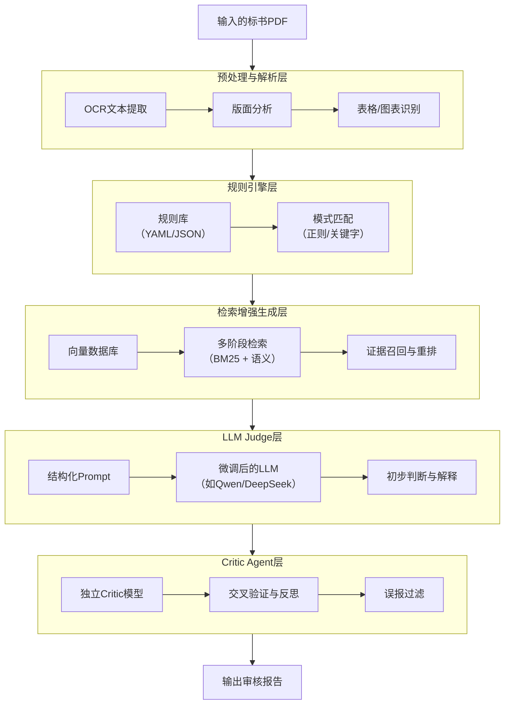

# 解决当前的问题

### 一、慢
多智能体（Multi-Agent）系统跑得慢，往往不是模型本身的问题，而是系统架构和资源调度不当导致的复合延迟。单纯的算力堆砌可能治标不治本。

可以从**架构精简、调度优化、推理加速和内存管理**这四个层面入手，系统性地排查和优化。

### ⚙️ 1. 架构“精简”：做减法，提升协作效率

盲目增加Agent数量是性能杀手。曾有案例显示，将一个系统从9个Agent精简到5个后，性能反而大幅提升。

*   **问题根源**：Agent越多，通信链路越复杂（9个Agent有36条潜在链路），上下文越容易爆炸，状态同步延迟呈指数级增长，且单个Agent的错误可能通过共享记忆“传染”给其他Agent。
*   **优化策略**：
    *   **重新评估Agent的必要性**：检查每个Agent的职能边界是否清晰，是否存在职责重叠，果断合并或裁撤冗余Agent。
    *   **采用“意图委派”模式**：设置一个“调度员”Agent，根据任务类型动态分配给最合适的专业Agent执行，减少无谓的全员广播和协商。
    *   **优化通信拓扑**：避免“全联通”的网状结构，改为星型或分层结构，让通信更有序。

### 🎯 2. 调度“智能化”：让合适的模型做合适的事

“一刀切”地用最强模型处理所有任务，是资源和时间的巨大浪费。

*   **“主-副”模型动态调度**：为不同复杂度的任务分配不同大小的模型。简单任务（如格式检查）用轻量模型快速处理，复杂推理任务（如条款语义分析）才调用大模型。
*   **预测性调度**：系统预估任务复杂度和各Agent的负载，将任务分配给执行后负载最均衡的Agent。例如，**Chimera**系统通过预估工作流的剩余输出长度和模型拥塞情况进行负载均衡，可将端到端延迟降低 **1.2倍至2.4倍**。
*   **即时（JIT）模型路由**：在工作流执行过程中，根据实时的系统负载动态调整后续步骤的模型配置。例如，**Aragog**系统在峰值请求率下可将中位延迟降低 **32.5% 至 78.9%**。

### ⚡️ 3. 推理“加速”：从模型内部挖掘潜力

这是最直接的性能优化层，专注于让每一次模型调用更快。

*   **推测解码 (Speculative Decoding)**：用一个快而小的“草稿”模型快速生成多个候选结果，再由大模型并行验证。这可将token生成速度提升 **2-3倍**。
    *   **进阶用法**：**推测性动作 (Speculative Actions)**，将思路从“推测token”扩展到“推测Agent的下一步动作”，让系统提前并行执行可能的分支，提交正确结果。
    *   **应用案例**：**Sherlock**系统通过“推测性执行”下游任务，将工作流执行时间最多缩短了 **48.7%**。
*   **模型压缩**：通过**量化**（如将模型精度从FP32降至INT8）和**剪枝**等技术，直接减小模型体积，加快推理速度。
*   **批量处理 (Batching)**：将多个独立的推理请求合并成一个批次进行处理，充分利用GPU的并行计算能力。

### 🧠 4. 缓存与内存“管理”：减少重复计算

Agent系统常常会反复执行相似或相同的操作，避免这些重复劳动能节省大量时间。

*   **语义缓存**：缓存LLM的提示词-响应对，甚至Agent的工具调用结果。当处理相似查询时，直接返回缓存结果，避免重复推理。
*   **KV Cache优化**：Transformer模型推理时，可缓存已生成的键值对(KV Cache)供后续token使用。使用**PagedAttention**等技术可解决显存碎片化问题，提高显存利用率。
*   **Prompt压缩**：在将上下文传给大模型前，先进行语义压缩，去除冗余信息，减少后续推理的token数量。

---

### 🚀 综合优化方案建议

结合你的标书审核场景，可以制定一个“诊断-精简-加速”的三步走计划：

1.  **第一步：性能剖析与架构诊断**
    *   **建立监控**：追踪每个Agent的执行耗时、Token消耗和通信开销。
    *   **识别瓶颈**：找到耗时最长、调用最频繁的Agent，以及是否存在严重的排队或等待现象。
    *   **评估精简空间**：检查是否有Agent职责重叠或可以合并。

2.  **第二步：实施核心优化（预计效果最显著）**
    *   **架构精简**：根据第一步的分析结果，果断合并或裁撤冗余Agent，并优化其通信结构。
    *   **引入智能调度**：实现“主-副”模型路由，让轻量模型处理格式检查等简单任务。
    *   **启用推测解码**：为推理最慢的Agent（如负责语义分析的Agent）配置推测解码。

3.  **第三步：进阶调优与系统固化**
    *   **建立多层缓存**：对文档解析结果、常见条款的审核结论等实施语义缓存。
    *   **应用模型压缩**：对不影响核心精度的模型进行量化，进一步降低延迟。
    *   **持续监控与迭代**：建立性能基准线，每次改动后对比数据，确保优化有效。

多智能体系统的优化是一个系统工程，关键在于**找到并消除真正的瓶颈**，而不是盲目地增加资源。通过“先做减法（精简架构），再做乘法（智能调度和推理加速）”的思路，你完全可以将单文档的审核时间控制在目标范围内。

## 二、不准确
构建一个高精度、低幻觉的标书合规性检查系统，关键在于采用一种将规则引擎的“确定性”与LLM的“语义理解力”相结合的**神经符号混合架构**。这并非简单的功能叠加，而是一种职责明确、流程分层的深度协同。

其核心思想是：**用规则引擎守住“确定性”底线，用LLM处理“不确定性”问题，并用一个独立的Critic Agent（评判智能体）来校验和过滤最终结果**。

以下是具体的系统设计与实现方案。

### 🏗️ 系统总体架构：五层漏斗式流水线

系统设计为一个五层流水线，逐层处理，步步精炼，旨在将潜在的误报率降至最低。其整体流程如下：

---

### 🧩 各模块详细设计

#### 1. 预处理与解析层：夯实基础
这是所有后续分析的基础。需要将非结构化的PDF文档转化为机器可读的结构化数据。
*   **技术选型**：使用**OCR技术**提取扫描件文字；通过**版面分析**和**表格识别**技术，将文档内容按标题、段落、页眉页脚、表格等语义单元进行结构化。
*   **关键步骤**：
    1.  **OCR与文字提取**：从PDF中提取所有文字信息。
    2.  **版面分析**：识别文档的物理结构（如页眉、页脚、正文、表格区域）。
    3.  **表格与图表识别**：将表格和图表内容转化为结构化数据（如JSON或CSV），以便后续规则和模型处理。

#### 2. 规则引擎层：守住合规底线
此层负责执行**确定性强、逻辑清晰**的规则检查，是所有审核的基础。它的输出是**高精度、零幻觉**的硬性违规标记。
*   **技术选型**：可采用 **Drools** 等成熟规则引擎，或自建轻量级引擎。
*   **规则库构建**：这是核心资产。应建立结构化、分层分域的规则库。
    *   **规则来源**：涵盖国家级政策法规、地方性规范以及行业部门要求。例如，贵州省的项目就整理了860份政策法规，构建了涵盖7大类110个检测点的规则库。
    *   **规则分层**：规则可按通用、审计、法务、行业专属等层级组织，便于管理和调用。
    *   **规则表示**：建议使用YAML或JSON格式定义规则，包含规则ID、触发条件（正则/关键字）、风险等级、依据和建议等字段。
*   **执行过程**：引擎将解析后的文档与规则库进行匹配。例如，规则可检测“资质要求是否包含A、B、C”、“报价是否超过预算上限”等。

#### 3. 检索增强生成层 (RAG)：为判断提供“法律依据”
此层负责为LLM的语义判断提供**可追溯的、具体的证据**。它解决了LLM“幻觉”和“知识陈旧”的问题。
*   **技术选型**：采用**混合检索**策略，结合基于**BM25**的词法检索和基于**向量**（如DPR）的语义检索。
*   **知识库构建**：
    *   **向量数据库**：将法规条文、标准合同范本、历史审核案例等文档进行切片，并生成向量嵌入，存入向量数据库。
    *   **知识图谱**：可构建行业知识图谱，增强对实体（如“安全文明施工费”）和关系（如条款间的“冲突”或“引用”）的理解。
*   **执行过程**：
    1.  **查询构造**：将待审核的文本片段作为查询。
    2.  **多路检索**：同时进行BM25词法检索和向量语义检索。
    3.  **重排序**：对检索结果进行重排序，选出最相关的Top-K个证据片段。
    4.  **证据注入**：将这些证据片段作为上下文，注入到下一步LLM的提示词中。

#### 4. LLM Judge层：进行语义层面的“终审”
此层是系统的“语义大脑”，负责处理规则引擎无法覆盖的**复杂、模糊、需要深度理解**的合规性问题。
*   **技术选型**：
    *   **基座模型**：选用对中文支持良好的模型，如**通义千问(Qwen)**、**DeepSeek**等。
    *   **领域适配**：通过**领域微调**让模型精通招投标语言。可采用**LoRA**等高效微调技术。
    *   **提示词工程**：设计结构化、带有明确角色和任务的提示词（Prompt），并要求LLM在回答中**引用RAG提供的证据**。
*   **执行过程**：将“待审核文本”和RAG召回的“相关法规/证据”组合成提示词，输入LLM。要求LLM判断是否存在违规，并给出理由和修改建议。

#### 5. Critic Agent层：最后的“质量把关人”
此层是系统的“校验官”，负责对LLM Judge的初步判断进行**反思、交叉验证和误报过滤**。
*   **技术选型**：可以使用另一个独立的LLM（可与Judge同规模或更小）作为Critic，或采用**LLM-as-a-Judge**的评估框架。
*   **执行过程**：
    1.  **接收与质疑**：Critic Agent接收Judge的输出、待审核文本和相关证据。
    2.  **交叉验证**：Critic会从对立或更严格的角度审视Judge的判断，例如检查其推理逻辑是否成立，引用证据是否充分。
    3.  **误报过滤**：对于Judge标记为“疑似违规”但Critic认为证据不足或判断有误的案例，将其标记为“误报”并过滤掉。
    4.  **输出最终结果**：Critic输出最终判断，并可附上简要的校验理由。

---

### 🎯 关键问题解决方案

#### 1. 长距离依赖：如何理解几十页的上下文？
*   **分而治之 + 层次化摘要**：将长文档按章节拆分为多个语义块，分别进行处理和初步判断，再通过一个“聚合器”模块整合各部分结论。
*   **RAG是核心武器**：不依赖模型的长上下文窗口，而是**按需检索**。当Judge需要判断某个条款时，RAG层能精准地召回前文或后文中相关的条款或定义，作为判断依据。
*   **知识图谱辅助**：对于跨页的实体和关系（如“付款条件”与“违约责任”的关联），知识图谱能提供超越文本顺序的结构化知识。

#### 2. 规则与LLM冲突：当“法理”与“情理”矛盾时
*   **明确优先级**：确立 **“规则引擎优先”** 的原则。对于规则引擎明确命中的硬性违规（如资质缺失），直接采纳，无需LLM介入。
*   **LLM处理“灰色地带”**：LLM主要处理规则引擎无法覆盖的领域，或对规则引擎的发现进行**复核与解释**。例如，规则引擎发现“报价异常低”，LLM可判断这是否属于“恶意低价竞标”。
*   **Critic Agent裁决**：当Judge的判断与规则引擎的发现不一致时，交由Critic Agent基于更多证据进行最终裁决。

#### 3. 误报过滤：如何减少低价值警报？
*   **漏斗式流水线**：这是最核心的策略。规则引擎产生大量**高召回、高误报**的候选问题；RAG提供证据进行第一轮过滤；LLM Judge进行语义判断，进一步降低误报；最后由Critic Agent进行精准过滤。
*   **启发式预检查**：在调用昂贵的LLM之前，先用轻量级的启发式规则（如黑名单、白名单）过滤掉明显无效的输入。
*   **阈值与置信度**：为LLM Judge的输出设置置信度阈值，仅输出高置信度的判断。

#### 4. 领域适应：如何让系统看懂“行话”？
*   **领域微调 (Fine-tuning)**：使用大量高质量的招投标领域语料（包括合规与不合规的案例）对基座模型进行微调。
*   **构建领域知识库**：RAG知识库是本领域的核心资产。需持续更新，纳入最新的法规、地方性规范、行业标准以及历史判例。
*   **规则库的持续迭代**：根据专家反馈和新的合规要求，不断更新和优化规则库。
*   **人机协同的反馈闭环**：建立“AI预审 + 专家复核”的机制。专家的修正意见应被系统记录，并用于**反哺模型微调和规则库优化**，形成持续学习的正向循环。

### 💎 总结
构建这样一个系统，本质上是在构建一个**可解释、可信赖、可进化**的合规审查数字专家。其核心在于**混合架构的精心设计与模块间的深度协同**，而非对单一技术的极致追求。通过上述方案，可以在保证高召回率的同时，有效控制误报率，并大幅提升对长文档和复杂语义的处理能力。

建议的落地路径是：**先以规则引擎为基础，快速构建MVP（最小可行产品）并跑通流程；然后逐步引入RAG和LLM Judge来处理复杂场景；最后加入Critic Agent来打磨精度**，形成一个持续迭代、效果递增的系统。
